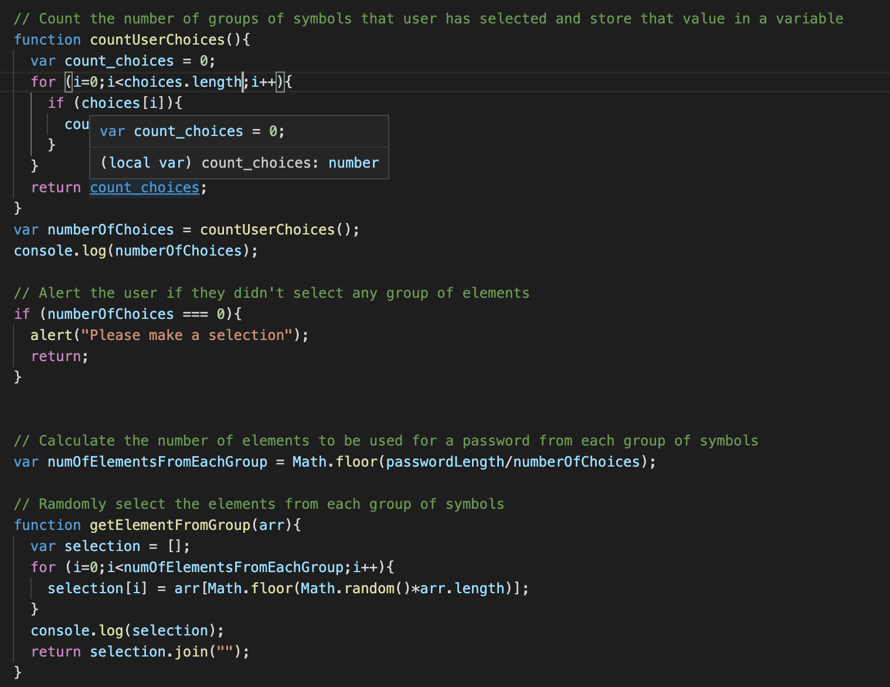

# Password_Generation
This repository contains the solution for the homework assignment for unit 3 of UW Coding Bootcamp. 

# Task
The goal of the task was to develop a code to generate a password based on the user-provided information.
The starter code (.html, .css and partially .js) was provided. The following modifications were expected:

* When the user clicks the "Generate Password" button, they can select the length of the password (between 8 and 128 characters) and types of characters to be used in the password (numbers, lowercase, uppercase, and special characters).

# URL to a live page
Link to a live page: https://kgo87.github.io/password_generation/  

# Project Summary
The folder contains  *.html* and  *.css*, modified *.js* files and supplemental screenshots.
## JS code
* At first I created lists of elements for every group of symbols and variables to store user selections (answers to prompt and confirm)

* Then I implemented a functionality that selects (randomly) equal number of items from each of the user-selected groups of symbols. The purpose of this feature is to ensure that the the elements of each group is included in the password. 

* The developed functionality is used to iterate over every user-selected group and select the calculated number of elements from each group, and combine it into an overall password. Assitionally, the elements from the user-selected groups are being added to the combined list of elements. For the odd password length, the last symbols for the password are being randonly selected from the combined group of elements

* The very last step is shuffling all the items in the generated password       

# Finished product
Here are several screenshots showing the functionality of the developed password generator.
If the user entered the accepted length of password and selected characters to be used, the password generator will produce this output:

If the user entered the incorrect value for the length of password, the page will produce this output:

If the user did not select any group of symbols the page will produce this output:

