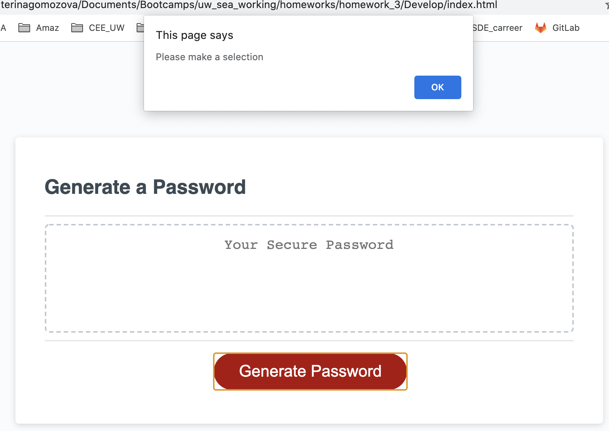

# Password_Generation
This repository contains the solution for the homework assignment for unit 3 of UW Coding Bootcamp. 

# Task
The goal of the task was to develop a code to generate a password based on the user-provided information.
The starter code (.html, .css and partially .js) was provided. The following modifications were expected:

* When the user clicks the "Generate Password" button, they can select the length of the password (between 8 and 128 characters) and types of characters to be used in the password (numbers, lowercase, uppercase, and special characters).

# URL to a live page
Link to a live page: https://kgo87.github.io/password_generation/  

# Project Summary
The folder contains  *.html* and  *.css* files and supplemental images.
## HTML code
* Perdonalized website title
* Navigation bar has links to can help to access different elements of the page
* When click on *Resume* button, the user is redirected to a page with resume
* Various semantic elements are used for better clarity
* *Github* and *LinkedIn* buttons redirects to Github and LinkedIn pages respectively.
* Screenshot of the part of the code is provided below:
               

## CSS code
* All methods include comments to describe what each method is doing
* Order of the methods match the sequence in HTML code
* Created variables for frequently used properties
* Implemented animated functionality when the user hovers to the elements
* Added functionality to display elements differently when the screen size changes
* Screenshot of the part of the code is provided below:

# Finished product
Here are several screenshots showing the functionality of the developed password generator.
If the user entered the accepted length of password and selected characters to be used, the password generator will produce this output:

If the user entered the incorrect value for the length of password, the page will produce this output:

If the user did not select any group of symbols the page will produce this output:

